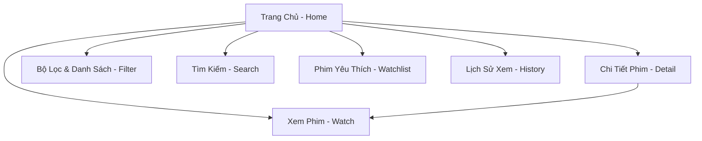

# TÀI LIỆU THIẾT KẾ WEBSITE XEM PHIM CAO CẤP - PHIMHOATOC (DESIGN.md)

Tài liệu này xác định ngôn ngữ thiết kế, kiến trúc giao diện người dùng (UI/UX), cấu trúc dữ liệu và các tính năng chính của ứng dụng xem phim trực tuyến **PhimHoaToc** được xây dựng trên nền tảng Next.js (sử dụng TailwindCSS hoặc Vanilla CSS theo yêu cầu - ở đây chúng ta sẽ thiết kế một hệ thống CSS cực kỳ hiện đại, mượt mà và linh hoạt nhất).

---

## 1. Ngôn Ngữ Thiết Kế & Thẩm Mỹ (Aesthetics)

Để tạo ra một website mang lại trải nghiệm xem phim rạp cao cấp (Premium Movie Theater Experience), chúng ta sẽ áp dụng các nguyên tắc thiết kế hiện đại nhất:

### 1.1. Bảng Màu (Color Palette)
Chúng ta sẽ sử dụng chủ đề tối (Dark Theme) làm mặc định và duy nhất vì nó tối ưu cho việc xem video, giảm mỏi mắt và mang lại cảm giác rạp phim huyền bí, sang trọng giống hệt Netflix.

*   **Nền chính (Background):** `Netflix Black` (`#141414`) và nền phụ/nền header tối sâu thẳm (`#000000`). Các panel phụ sử dụng màu xám tối (`#1F1F1F`).
*   **Màu chủ đạo (Primary Accent):** `Netflix Red` (`#E50914`) dùng làm màu nhận diện chính, nút bấm phát phim và các điểm nhấn rực rỡ. Khi hover chuyển sang màu đỏ sẫm (`#C11119`).
*   **Màu phụ (Secondary Accent):** Màu xám sáng (`#E5E5E5`) dùng cho các huy hiệu trạng thái chất lượng (HD, Vietsub) và các tiêu đề phụ.
*   **Màu chữ (Typography):**
    *   Chữ chính (Primary Text): Trắng tinh khiết (`#FFFFFF`) để đạt độ tương phản cao nhất.
    *   Chữ phụ (Secondary Text): Xám trung tính (`#A3A3A3` hoặc `#808080`) cho thông tin diễn viên, mô tả ngắn.
    *   Chữ tắt/Hỗ trợ: Xám đậm (`#555555`).

### 1.2. Hiệu Ứng Phản Hồi & Động (Micro-animations & Interactive States)
*   **Glassmorphism (Lớp kính mờ):** Header và các panel phụ sẽ sử dụng thuộc tính `backdrop-blur-md` kết hợp nền bán trong suốt `rgba(20, 20, 20, 0.75)` và viền mỏng (`border-zinc-800/50`) để tạo chiều sâu cho giao diện.
*   **Hover Effects:**
    *   **Thẻ phim (Movie Card):** Khi di chuột qua, thẻ phim sẽ phóng to nhẹ (`scale-105`), tăng độ sáng của ảnh poster, hiển thị một lớp overlay gradient tối mịn màng, và nút "Xem ngay" (Play icon) sẽ trượt lên từ phía dưới. Viền thẻ phim sẽ phát sáng nhẹ màu đỏ Netflix.
    *   **Nút bấm (Buttons):** Sử dụng transition mịn màng (`transition-all duration-300`), khi hover nút dạng gradient sẽ chuyển đổi vị trí gradient hoặc tăng độ sáng (brightness-110).
*   **Trình phát Video (Video Player):** Khi di chuột vào trình phát, các thanh điều khiển sẽ hiện lên mượt mà; khi không tương tác, chúng sẽ mờ đi để tối ưu hóa góc nhìn.

### 1.3. Font Chữ (Typography)
*   Sử dụng font chữ **Inter** hoặc **Outfit** từ Google Fonts. Font này có nét vẽ hình học tinh tế, hiện đại, độ dễ đọc cực cao ở mọi kích thước từ nhỏ đến lớn.

---

## 2. Kiến Trúc Trang & Sơ Đồ Điều Hướng (Site Map)

Ứng dụng sẽ bao gồm các trang chính sau đây, tất cả đều được tối ưu hóa SEO và Responsive hoàn toàn (tương thích từ điện thoại màn hình nhỏ đến màn hình 4K siêu lớn):

### 2.1. Chi Tiết Các Trang
1.  **Trang Chủ (Home Page):**
    *   **Hero Slider:** Banner phim nổi bật khổ rộng (Full-width), hiển thị ảnh poster ngang cực đẹp, tiêu đề phim lớn, điểm đánh giá, thể loại và mô tả tóm tắt cùng nút "Xem Phim" và "Chi tiết".
    *   **Cơ chế tải danh mục trang chủ:** Các Slider dạng hàng ngang (Carousel) cuộn mượt mà chứa:
        *   Phim mới cập nhật.
        *   Phim lẻ hot nhất (Single Movies).
        *   Phim bộ hot nhất (Series Movies).
        *   Hoạt hình đặc sắc (Anime/Cartoon).
        *   TV Shows sôi động.
2.  **Trang Chi Tiết Phim (Movie Detail Page):**
    *   **Backdrop Banner:** Ảnh nền phim kích thước lớn, được làm mờ (blur) và phủ một lớp gradient tối để tạo chiều sâu nghệ thuật.
    *   **Thông Tin Phim:** Hiển thị Poster dọc, Tên phim tiếng Việt, Tên gốc, năm phát hành, thời lượng, số tập hiện tại, trạng thái, thể loại, quốc gia, đạo diễn và dàn diễn viên chất lượng cao.
    *   **Nội Dung Tóm Tắt (Synopsis):** Mô tả cốt truyện có tính năng "Xem thêm/Thu gọn" trực quan.
    *   **Trình Chọn Tập Phim:** Chia nhóm theo Server phát sóng (Server Embed và Server Stream), hiển thị danh sách tập phim cực kỳ gọn gàng, dễ bấm.
    *   **Danh Sách Phim Liên Quan (Related Carousel):** Gợi ý các bộ phim cùng thể loại.
    *   **Bình Luận:** Hệ thống bình luận lưu trữ nội bộ (Local Storage) cực kỳ xịn sò, cho phép người dùng nhập tên, avatar ngẫu nhiên và bình luận thảo luận sôi nổi về bộ phim.
3.  **Trang Xem Phim (Watch Page):**
    *   **Khu Vực Trình Phát Video (Cinema Container):** Trình phát phim chiếm không gian lớn, hỗ trợ 2 chế độ:
        *   *Chế độ thông thường:* Giao diện tiêu chuẩn với thanh thông tin bên dưới.
        *   *Chế độ rạp phim (Cinema Mode):* Làm tối toàn bộ phần còn lại của trang web, chỉ tập trung ánh sáng vào trình phát video.
    *   **Bộ Chọn Server & Tập Phim:** Cho phép chuyển đổi linh hoạt giữa các tập và các server phát khác nhau nếu xảy ra lỗi.
    *   **Chức Năng Tự Động Lưu Tiến Trình (Auto-Resume):** Sử dụng LocalStorage để lưu lại số giây đang xem của tập phim. Khi quay lại tập đó, hệ thống sẽ hỏi người dùng có muốn xem tiếp từ vị trí cũ hay không.
    *   **Các Nút Tiện Ích:** "Tập trước", "Tập tiếp theo", "Báo lỗi", "Yêu thích".
4.  **Trang Bộ Lọc & Tìm Kiếm Nâng Cao (Explore Page):**
    *   Bộ lọc đa tiêu chí dạng lưới (Grid Filter): Thể loại, Quốc gia, Năm phát hành, Sắp xếp (Mới nhất, Xem nhiều nhất, Năm tăng/giảm dần).
    *   Hiển thị danh sách phim dạng Grid responsive (2 cột trên Mobile, 3 cột trên Tablet, 4-5 cột trên Desktop).
    *   Phân trang (Pagination) mượt mà không tải lại trang.
5.  **Trang Tìm Kiếm (Search Page):**
    *   Hiển thị kết quả tìm kiếm theo từ khóa.
    *   Tích hợp tính năng **Instant Search** ngay tại thanh tìm kiếm ở Header (Hiển thị popup kết quả nhanh khi người dùng đang gõ phím).
6.  **Trang Watchlist & Lịch Sử (Watchlist & History Page):**
    *   Quản lý danh sách các bộ phim đã lưu để xem sau.
    *   Xem danh sách các bộ phim đã xem gần đây kèm thanh tiến trình đã xem được bao nhiêu % (ví dụ: đã xem 45 phút / 90 phút).

---

## 3. Kiến Trúc Công Nghệ & Tối Ưu Hóa (Technology & Performance)

### 3.1. Framework & State Management
*   **Framework:** Next.js (App Router) phiên bản mới nhất, tận dụng tối đa Server Components để tải dữ liệu cực nhanh cho SEO, kết hợp Client Components cho các tương tác phức tạp như Trình phát video, slider, bình luận.
*   **State Management:** React Context API hoặc Zustand (nếu cần thiết) để quản lý danh sách yêu thích, lịch sử xem, và trạng thái Cinema Mode trên toàn trang.
*   **Styling:** Sử dụng Vanilla CSS hoặc TailwindCSS được thiết kế tùy biến, tránh lặp lại code, tạo ra các class CSS dùng chung chuyên nghiệp.

### 3.2. Trình Phát Video (Video Player)
*   Đối với server có link trực tiếp `.m3u8` (HLS Stream): Sử dụng **Hls.js** tích hợp trên thẻ `<video>` HTML5 tiêu chuẩn hoặc sử dụng thư viện trình phát cao cấp **ReactPlayer** / **Video.js** / **Plyr** với giao diện tùy chỉnh cao cấp, chống quảng cáo popup từ nguồn.
*   Đối với server embed iframe: Sử dụng thẻ `<iframe>` được sandbox an toàn để ngăn chặn các popup quảng cáo tự động nhảy ra ngoài trang web, giữ trải nghiệm xem phim của người dùng luôn sạch sẽ và cao cấp.

### 3.3. Tối Ưu Hóa Trải Nghiệm (UX Optimization)
*   **Lazy Loading:** Toàn bộ ảnh Poster phim sẽ được tải chậm (Lazy loaded) và tối ưu hóa kích thước bằng thuộc tính Next.js `Image` để tăng tốc độ tải trang ban đầu.
*   **Skeleton Loading Screen:** Trong quá trình API đang phản hồi, các khung sườn màu xám chuyển động (Skeleton pulse) sẽ được hiển thị để tránh hiện tượng bố cục trang bị nhảy giật cục bộ.
*   **Image Fallback:** Nếu link ảnh từ API bị lỗi hoặc không tồn tại, một ảnh đại diện mặc định cực đẹp của PhimHoaToc sẽ được hiển thị thay thế để đảm bảo thẩm mỹ toàn diện.

---

## 4. Kế Hoạch Đảm Bảo SEO & Khả Năng Truy Cập (Accessibility)

*   **Semantic HTML:** Sử dụng triệt để các thẻ `<header>`, `<nav>`, `<main>`, `<section>`, `<article>`, `<footer>` để bộ máy tìm kiếm Google dễ dàng thu thập thông tin cấu trúc trang.
*   **Dynamic Metadata:** Mỗi trang chi tiết phim sẽ tự động tạo thẻ tiêu đề và mô tả động (Dynamic SEO Title & Description) chứa tên phim, năm sản xuất và quốc gia để tăng thứ hạng tìm kiếm.
*   **JSON-LD Structured Data:** Nhúng dữ liệu cấu trúc Movie Schema của Google cho trang chi tiết phim nhằm hỗ trợ hiển thị Rich Snippets trên kết quả tìm kiếm Google (hiển thị ảnh phim, đạo diễn, đánh giá...).
*   **Khả năng truy cập:** Đảm bảo tất cả các thẻ hình ảnh đều có thẻ mô tả `alt`, các nút tương tác đều có mô tả đầy đủ để tương thích tốt với các trình đọc màn hình (Screen readers).

---

*Tài liệu thiết kế này là kim chỉ nam cho quá trình xây dựng dự án PhimHoaToc. Chúng tôi cam kết tạo ra một sản phẩm hoàn thiện, chỉnh chu nhất từng pixel.*
